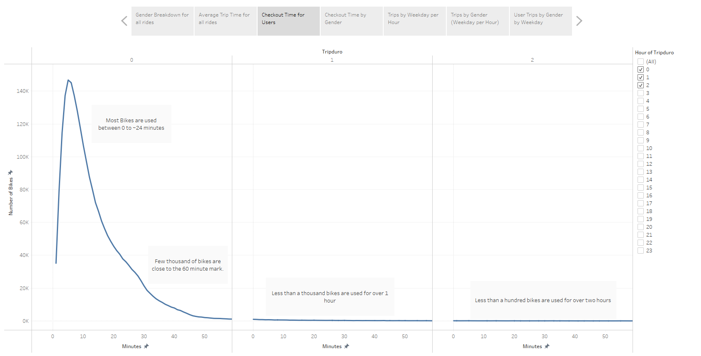
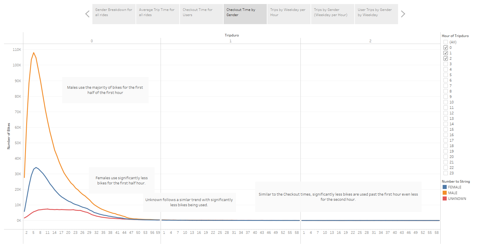
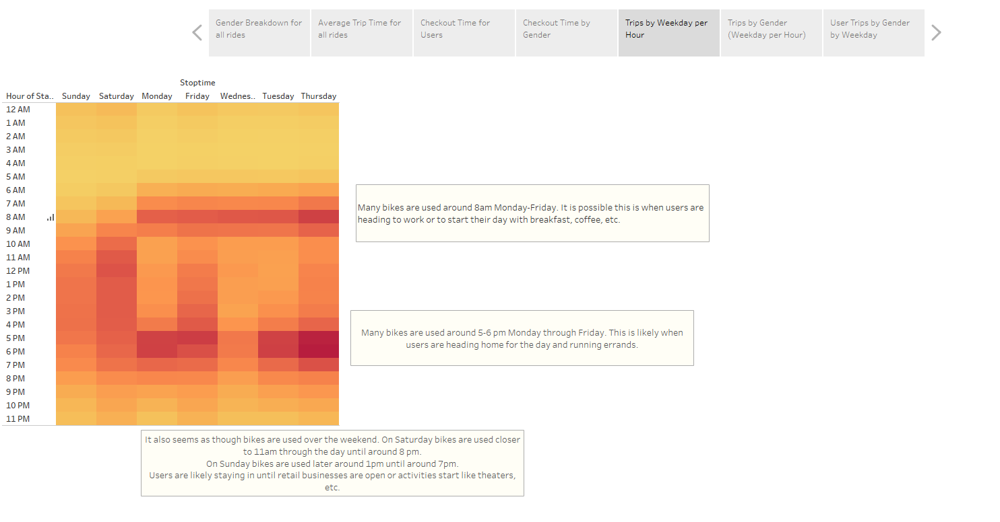
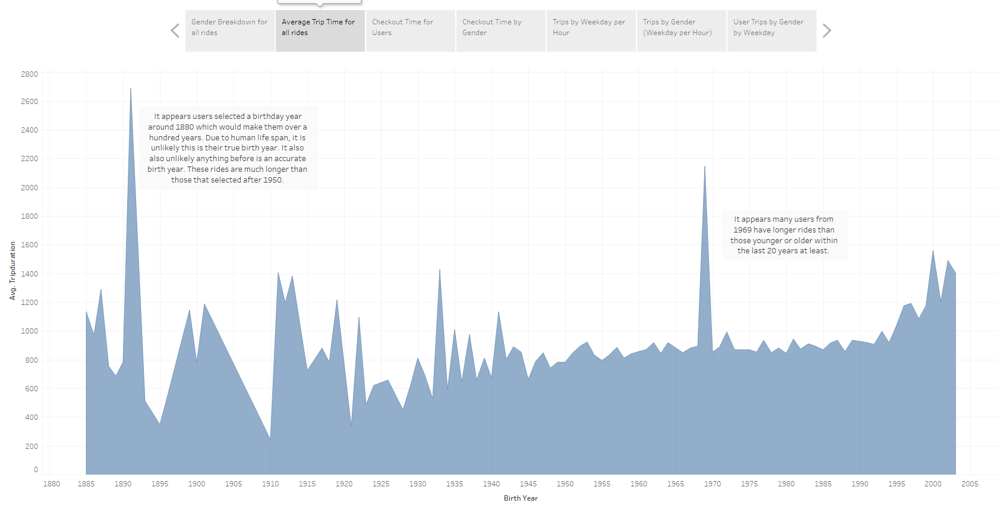

# bikesharing

## Overview of Analysis
Using data for Citi Bikes, converting  the total duration to a a datetime data type, the data was then loaded into Tableau.
Here visualizations were created to show trends for time of day, day of week, gender, and user types to display trends. 
A Tableau story was created to cover each visualization to identify any potential reasons for these trends or any observations.

## Results

### Checkout Time for Users

 
*Deliverable 2 Chart 1*

This chart focused on how long users generally user bikes and how many bike rides occur.
As most data is within the first 2 hours, this was the time used for the three charts - 0 hours to less than 3 hours.
Most rides last less than 24 minutes with rides peaking over 140k before dropping after the 30 minute mark where less than 20k of rides might occur.
Bike rides don't last much longer than an hour. Only about a thousand pass the hour mark.
By the two hour mark, there are less than a hundred bike rides that last that long.

### Checkout Time by Gender

 
*Deliverable 2 Chart 2*

This chart has similar to data to Chart 1. The difference is now it shows the gender. 
This chart shows that the majority of users within the first half hour are Males peak at close to the 110K mark.
Women are riding citi bikes much less for that same time period.
Unknown are also riding even less during that time.
Very few rides last past the first hour similar to Chart 1.

### Trips by Weekday per Hour

 
*Deliverable 2 Chart 3*

This chart shows the the usuage throughout the week and 24 hours of each day.
Most rides occur Monday through Friday at 8am and around 5-6pm.
It is possible that this is when users are going to work or picking up food/coffee at 8am and leaving work and running errands like grocery store around 5-6.
During the weekends, bikes seem to be used later in the day likely due to users being able to stay in a bit longer before starting their weekend activities.
It also seems as though the weekends do not reach as much usage as the weekdays during peak hours.

### Trips by Gender (Weeday per Hour)

 
*Deliverable 2 Chart 4*

This chart shows similar informaiton as chart 3 in that is shows peak days and times. The difference is that it focuses on gender.
Similar to chart 2, it also shows more males use bikes than females.
Peak hours follow similar trends to chart 3 in that for both Male and Females use the bikes around 8am and 5-6 in the evening and on the weekends later than during the week.
There are less unknown users than male or female, but the amount does seem to go up during the weekend suggesting perhaps there are tourist/visitors who don't share their information.

### User Trips by Gender by Weekday

 
*Deliverable 2 Chart 5*

This chart shows whether the user is a customer, or subscriber as well as the gender and usage.
It seems subscribers use the bikes the most. As seen in both chart 2 and chart 4 Males are the biggest users and they happen to be the most subsribers.
Females also subsribe in lower quantities.
Thursday seems to be the heaviest day for subscribers.
Many unknown users use bikes on Sunday and Friday which supports the idea of tourists/visitors who may not be subsribed may be accessing these bikes.

 
*Deliverable 3 Chart 1 from Module - Gender Breakdown*

This chart shows that there are over one million more male users than female users.
This chart also shows that there are more unknown users than female users.

 
*Deliverable 3 Chart 2 from Module - Average Trip Time per birth year*

This chart shows it is likely the data is inaccurate as there are very long rides conducted by those in the 1980s. Life expectency is less than a hundred years old and this is well over a hundred years old. The average time of their trips are very high in comparison to the majority of the data.

It also appears as though those born around 1969 have very long average bike ride times. Almost double that than those younger or older than them.

It is possible that both these data points are inaccurate.

## Summary

### Chart Summary
Overall, it seems most users are subsribers.
The majority of subscribers are males who use the bikes Monday-Friday around 8am and 5-6pm. They also use bikes over the weekend in greater quantities than females or unknown.
Women subscribers use bikes around the same times as men but in less numbers.
There are many unknown users who used the bike over the weekend when tourists/visitors might be in the area.
The majority of bikes used by subscribers is on Thursday.
Bikes are used for less than 30 minutes for the majority of rides.
Most users seem to be males.
Most rides seem to be less than 1000.

### Additional Charts
For one chart, the focus  could be age bins where I could create bins based on 10 year intervals to determine what age groups are riding bikes on specific weekdays and times.

For another chart, the focus could be on correlation of age bins with user status. Perhaps there are more or less subscribers of each age bin group.

[link to dashboard](https://public.tableau.com/views/NYC_Citi_Bike_16405696095220/CitiBikeChallenge?:language=en-US&publish=yes&:display_count=n&:origin=viz_share_link)